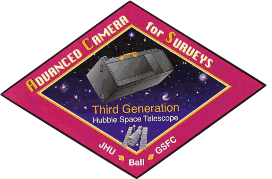

[](http://www.stsci.edu/hst/acs) [](http://www.stsci.edu/) 



# acs-notebook

This repository contains Jupyter notebooks to demonstrate how to calibrate and analyze data from the *Hubble Space Telescope* (*HST*) Advanced Camera for Surveys (ACS). Users are advised to visit the [ACS website](http://www.stsci.edu/hst/acs), [Instrument Handbook](http://www.stsci.edu/hst/acs/documents/handbooks/current/cover.html), and [Data Handbook](http://www.stsci.edu/hst/acs/documents/handbooks/currentDHB/acs_cover.html) for more information about the the current status of ACS, instrument specifications, and data analysis.

Users who need help transitioning from IRAF/PyRAF to Python should see the [stak-notebooks](https://github.com/spacetelescope/stak-notebooks) repository. 

If you have questions about HST data analysis, calibration software, instrument capabilities, and/or the methods discussed in this repository, please visit the [HST Help Desk](http://hsthelp.stsci.edu). Through the help desk portal, you can explore the HST Knowledge Base and request additional help from experts.

# Getting Started

To download the notebooks in this repository, simply open a terminal, go to the directory where you would like the notebooks to be, and type
```
git clone https://github.com/spacetelescope/acs-notebook.git
```
which will create a new acs-notebook/ directory containing the contents of this repository.
 
___Warning:___ Before running these examples, you must install or update to the latest version of [stenv](https://stenv.readthedocs.io/en/latest/).

Jupyter Notebooks allow code to be packaged with formatted text to create illustrative examples. Users who are unfamiliar with Jupyter Notebooks should also see the [short guide](https://jupyter-notebook-beginner-guide.readthedocs.io/en/latest/) for how to use these tools.

# Contents

## Complex Workflow Notebooks

* **acs_reduction**: This worked example demonstrates how to use the CALACS pipeline to re-process raw ACS data retrieved from MAST. Users are shown how to update reference files in the image headers, retrieve reference files from the Calibration Reference Data System (CRDS), and how to toggle steps in the calibration pipeline (e.g., the CTE correction). 

* **acs_cte_forward_model** The capability to simulate the readout of an ACS image at a given epoch was recently added to CALACS. This example demonstrates how to take an image corrected for time-dependent CTE loss and then simulate the CTE effects on the same image if observed at another time.

* **acs_saturation_trails** The ACS/WFC CCDs remain linear beyond the full-well saturation, which allows users the opportunity to perform photometry on even saturated stars. This notebook demonstrates the methods and caveats when performing saturated star photometry.

* **acs_sbc_dark_analysis.ipynb**: The ACS Solar Blind Channel (SBC) has nominally negligible dark current. However, the temperature of the SBC detector increases steadily over time while it is in use, and the dark current is proportional to temperature. At temperatures above 25 ºC, the dark current is no longer negligible and must be subracted. This workflow demonstrates how to account for dark current in ACS/SBC observations.

## Simple Example Notebooks

* **acs_subarrays**: Instructions for how to use the `acs_destripe_plus` code to calibrate, de-stripe, and correct ACS subarray observations for charge transfer efficiency (CTE). Also included are instructions for updating the `OSCNTAB` reference file to subtract the bias level from the prescan columns in user-defined subarray observations.

* **pixel_area_maps**: How to use Python to create pixel area maps (PAMs) to account for the effects of geometric distortion in distorted images. This enables users to perform photometry on distorted images if desired.

## Contributing

If you have feedback concerning our documentation or examples presented here on GitHub, please open an [issue](https://github.com/spacetelescope/acs-notebook/issues). For feedback concerning content exclusively from the ACS website, Instrument Handbook, or Data Handbook, or for questions about ACS in general, please contact the ACS Branch at STScI via the [Hubble Space Telescope Help Desk portal](http://hsthelp.stsci.edu). 
